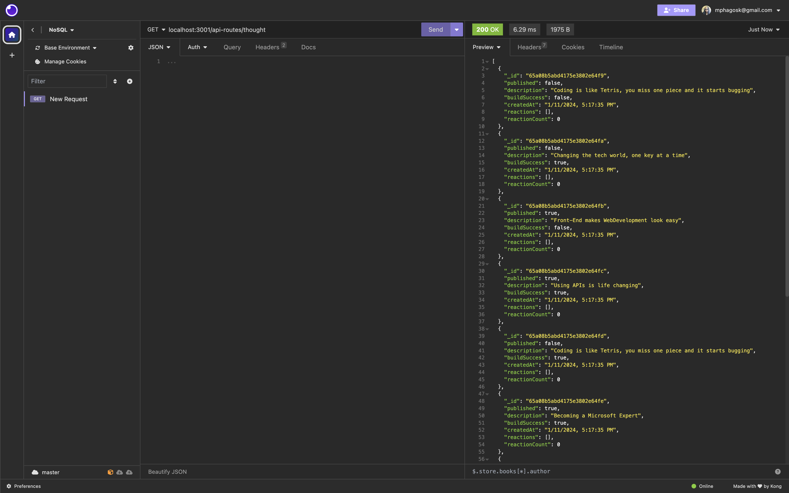
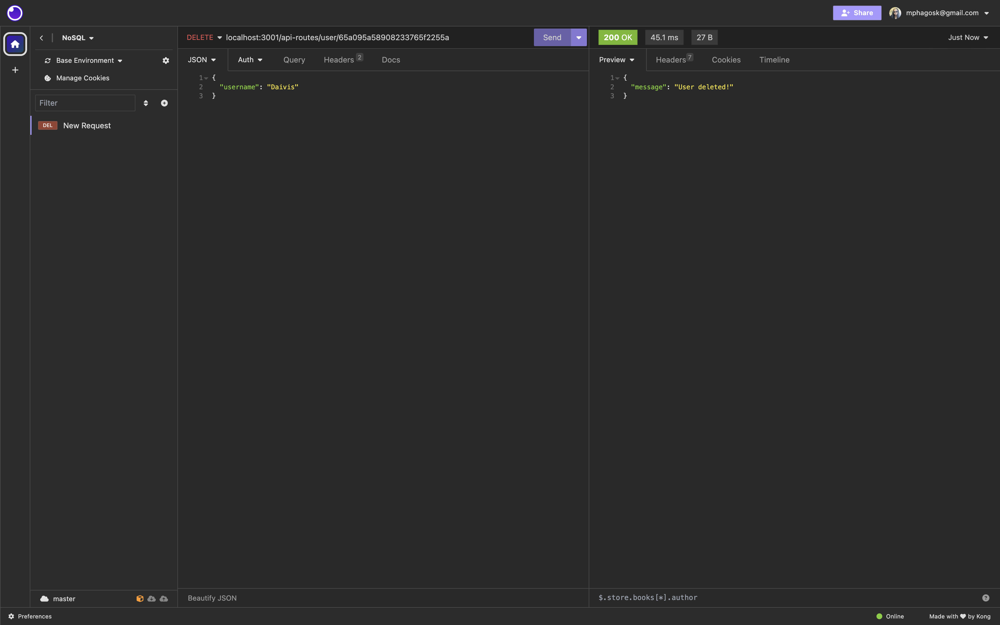

# Social_Network-API

In this challenge we had to build an API for a Social Network Web Application that allows users to share thoughts and reactions with friends. This is similar to some social media platforms that allow users to do this.

## Packages Used

- Express.js
- Mongoose

## Links

- [Github Repository](https://github.com/Saiishago/Social_Network-API)
- [Walkthrough](https://drive.google.com/file/d/1_DftOUWAUdF0j6yRkJkGoK3u8Vj3ArY3/view?usp=sharing)

## Getting Started

- Install MongoDB
  Follow the [MongoDB installation guide on The Full-Stack Blog](https://coding-boot-camp.github.io/full-stack/mongodb/how-to-install-mongodb) to install MongoDB locally.
- Run npm install to install the packages that will be used.
- Use Insomnia to test APIs

## Mock Ups

Tested API Routes in Insomnia

- GET
*Users*

*Thoughts*

*single* *Thought*

- POST
*User*

- PUT
*User*

- DELETE
*User*

### Author
Salome Mphago [SalomeK](https://github.com/Saiishago/Social_Network-API)
